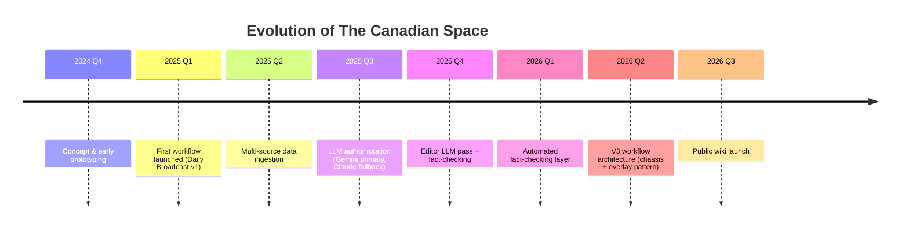

# The story so far

*The Canadian Space* started as a question: "Can we use AI to write a daily aerospace briefing, and do it transparently?" 

Here's how it evolved.

## Milestones

## What happened when

**Late 2024** we sketched out the idea: a fully transparent, self-hosted aerospace briefing service powered by public APIs and LLMs. No fancy VC pitch, no complicated licensing—just good reporting powered by good tools.

**Early 2025** we shipped the first Daily Broadcast workflow. It was rough, but it worked: pull articles from SNAPI, route to Gemini, publish to WordPress. No editorial pass, no fallbacks, no automated QA yet. Just the core loop.

**Spring 2025** we added data sources. Launch Library 2 for launches, RSS feeds for niche coverage, Wikipedia for context. The Daily Broadcast got richer.

**Summer 2025** we rotated in Claude as a fallback and brought in editorial workflows. If Gemini was slow or had an off day, Claude could step in. A human editor review gate went in too (that's still there).

**Spring 2026** we redesigned the entire workflow architecture. What started as a single Daily Broadcast workflow exploded into modular, reusable pieces: a **chassis** workflow for data collection, **overlay** workflows for synthesis and editorial. You can use the same pieces to build Weekly Spotlights, Monthly Deep Dives, or totally custom content. That's the V3 pattern, and it's opened doors for future projects.

**Now (July 2026)** we're launching this wiki. Every page here represents something we wanted to share openly: how we source data, how we architect systems, what we learned along the way. Not a marketing brochure—a real technical walkthrough.

## What's next

We're working on two big things:

- **tcs-arcade**: A community hub for sharing n8n workflows and data tools. If you want to build your own aerospace reporting system, or remix ours, this is where it lands.
- **tcs-webpage rebuild**: Redesigning thecanadian.space itself. Right now it's WordPress stock. Soon it'll be a modern, hand-crafted site that reflects who we are.

Both are in active development. When they're ready, this wiki gets the first announcement.

---

!!! quote "We're learning in public because transparency matters in AI."
    Every choice we've made—from picking n8n over a managed platform, to choosing Gemini + Claude, to tracking costs obsessively—is defensible, documented, and improvable. You can read how we work and decide if it's right for you.

For detailed release notes on every feature drop and infrastructure change, head over to the [blog archive](../blog/index.md).
