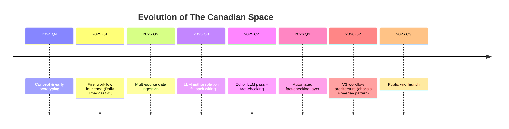

# The story so far

*The Canadian Space* started as a question: "Can I build something that keeps me on top of aerospace news without spending my whole morning on it?" The answer turned into a passion project.

Here's how it evolved.

## Milestones

## What happened when

**Late 2024** — sketched out the idea: a fully transparent, self-hosted aerospace briefing service powered by public APIs and LLMs. No fancy VC pitch, no complicated licensing — just good aggregation powered by good tools.

**Early 2025** — shipped the first Daily Broadcast workflow. It was rough, but it worked: pull articles, route through an LLM, publish to WordPress. No editorial pass, no fallbacks, no automated QA yet. Just the core loop.

**Spring 2025** — added data sources. Launch Library 2 for launches, RSS feeds for niche coverage, Wikipedia for context. The Daily Broadcast got richer.

**Summer 2025** — rotated in a fallback LLM. If the primary model was slow or having an off day, the fallback could step in. A human editor review gate went in too (that's still there and non-negotiable).

**Spring 2026** — redesigned the entire workflow architecture. What started as a single Daily Broadcast workflow exploded into modular, reusable pieces: a **chassis** workflow for data collection, **overlay** workflows for synthesis and editorial. The same pieces power Weekly Spotlights, Monthly Deep Dives, and any future workflow we build. That's the V3 pattern.

**Now (July 2026)** — launching this wiki. Every page here represents something worth sharing openly: how we source data, how the pipeline works, what we learned along the way. Not a marketing brochure — a real technical walkthrough.

## What's next

We're working on:

- **tcs-webpage rebuild** — redesigning [thecanadian.space](https://thecanadian.space) itself. Right now it's a WordPress theme; soon it'll be a modern, hand-crafted site that matches this wiki's look and feel.
- **tcs-arcade** — a community hub for sharing n8n workflows and data tools. If you want to build your own aerospace-news system, or remix ours, this is where it'll live. Not shipped yet.
- **Discord bot** — news stream notifications and a place for readers to hang out.

When any of these ship, this wiki gets the first announcement.

---

!!! quote "We're learning in public because transparency matters."
    Every choice we've made — from picking n8n over a managed platform, to rotating LLMs, to tracking every dependency — is documented and improvable. Read how we work and decide if it's right for you.

For detailed release notes on every feature drop and infrastructure change, head over to the [blog archive](../blog/index.md).
