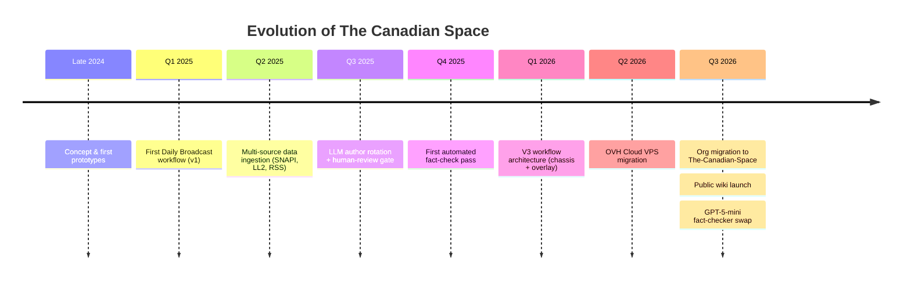

# The story so far

*The Canadian Space* started as a question: "Can I build something that keeps me on top of aerospace news without spending my whole morning on it?" The answer turned into a passion project.

Here's how it evolved, and the big moments along the way.

## Milestones

```mermaid
timeline
    title Evolution of The Canadian Space
    Late 2024 : Concept & first prototypes
    Q1 2025   : First Daily Broadcast workflow (v1)
    Q2 2025   : Multi-source data ingestion (SNAPI, LL2, RSS)
    Q3 2025   : LLM author rotation + human-review gate
    Q4 2025   : First automated fact-check pass
    Q1 2026   : V3 workflow architecture (chassis + overlay)
    Q2 2026   : OVH Cloud VPS migration
    Q3 2026   : Org migration to The-Canadian-Space : Public wiki launch : GPT-5-mini fact-checker swap
```

## What happened when

**Late 2024** — sketched out the idea: a fully transparent, self-hosted aerospace briefing service powered by public APIs and LLMs. No fancy VC pitch, no complicated licensing — just good aggregation powered by good tools.

**Early 2025** — shipped the first Daily Broadcast workflow. It was rough, but it worked: pull articles, route through an LLM, publish to WordPress. No editorial pass, no fallbacks, no automated QA yet. Just the core loop.

**Spring 2025** — added data sources. Launch Library 2 for launches, RSS feeds for niche coverage, Wikipedia for context. The Daily Broadcast got richer.

**Summer 2025** — rotated in a fallback LLM. If the primary model was slow or having an off day, the fallback could step in. A human editor review gate went in too (that's still there and non-negotiable).

**Late 2025** — the first automated fact-check pass landed. An editor LLM reads every draft against its cited sources before it reaches Chris, catching numbers, dates, and names that got mangled in summarization.

**Q1 2026** — redesigned the entire workflow architecture. What started as a single Daily Broadcast workflow became modular, reusable pieces: a **chassis** workflow for data collection, **overlay** workflows for synthesis and editorial. The same pieces now power weekly reports (SpaceX, NASA) and monthly deep dives (Canada From Orbit, Rocket Lab, Bright Blue Origin, Commercial Space). That's the V3 pattern.

**April 2026** — migrated the whole stack to an OVH Cloud VPS. Predictable annual billing, more headroom for the growing pipeline, and full control.

**July 2026** — migrated the code repos from Chris's personal GitHub account to a dedicated [The-Canadian-Space](https://github.com/The-Canadian-Space){target="_blank" rel="noopener"} organisation. Signals that TCS is a real project, not a scratch experiment.

**July 2026** — launched this wiki. Every page here represents something worth sharing openly: how we source data, how the pipeline works, what we learned along the way. Not a marketing brochure — a real technical walkthrough. Read the launch announcement in [Big moments](#big-moments).

**August 2026** — swapped the fact-checker from Claude Haiku 4.5 to OpenAI GPT-5-mini. Similar catch rate, roughly a third of the per-run cost. Haiku 4.5 stays wired as the author fallback.

## Big moments

The bigger announcements — game launches, site redesigns, feature drops, milestones worth their own page — go up as posts on the [Big moments blog](../blog/index.md).

Highlights so far:

- **July 2026 — Wiki launch** — how the wiki went from "we should probably explain what we're doing" to a live docs site in a weekend of work.

New posts land as they happen — browse the [full archive](../blog/index.md) for anything not surfaced here yet.

## What's next

We're working on:

- **tcs-webpage rebuild** — redesigning [thecanadian.space](https://thecanadian.space){target="_blank" rel="noopener"} itself. Right now it's a WordPress theme; soon it'll be a modern, hand-crafted site that matches this wiki's look and feel.
- **tcs-arcade** — browser games under The-Canadian-Space (`autodoom`, `idle-launch`, and shared platform layers `maxq` and `mission-control`). In early development.
- **Discord server + alerting bot** — news-stream notifications and a place for readers to hang out.

When any of these ship, this wiki gets the first announcement.

---

!!! quote "We're learning in public because transparency matters."
    Every choice we've made — from picking n8n over a managed platform, to rotating LLMs, to tracking every dependency — is documented and improvable. Read how we work and decide if it's right for you.
