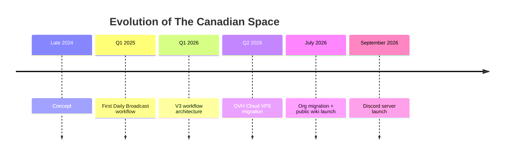

# The story so far

*The Canadian Space* started as a question: "Can I build something that keeps me on top of aerospace news without spending my whole morning on it?" The answer turned into a passion project.

Here's how it evolved, and the big moments along the way.

## Milestones

```mermaid
timeline
    title Evolution of The Canadian Space
    Late 2024      : Concept
    Q1 2025        : First Daily Broadcast workflow
    Q1 2026        : V3 workflow architecture
    Q2 2026        : OVH Cloud VPS migration
    July 2026      : Org migration + public wiki launch
    September 2026 : Discord server launch
```

## What happened when

**Late 2024** — sketched out the idea: a fully transparent, self-hosted aerospace briefing service powered by public APIs and LLMs. No fancy VC pitch, no complicated licensing — just good aggregation powered by good tools.

**Q1 2025** — shipped the first Daily Broadcast workflow. Pull articles, route through an LLM, publish to WordPress. Rough but real — the daily automated publication that everything else grew from.

**Q1 2026** — redesigned the entire workflow architecture. What started as a single Daily Broadcast became modular, reusable pieces: a **chassis** workflow for data collection, **overlay** workflows for synthesis and editorial. The same pieces now power weekly reports (SpaceX, NASA) and monthly reports (Canada From Orbit, Rocket Lab, Blue Origin, Commercial Space). That's the V3 pattern — the platform.

**Q2 2026** — migrated the whole stack to an OVH Cloud VPS. Own infrastructure, predictable billing, headroom for the growing pipeline.

**July 2026** — moved the code repos from Chris's personal GitHub account to a dedicated [The-Canadian-Space](https://github.com/The-Canadian-Space){target="_blank" rel="noopener"} organisation, and launched this wiki. TCS became a real project with public documentation, not a scratch experiment. Read the launch announcement in [Big moments](#big-moments).

**September 2026** — launched the Discord server. First proper community space for readers and a place for news-stream alerting to land.

## Big moments

The bigger announcements — feature drops, milestones worth their own page — go up as posts on the [Big moments blog](../blog/index.md).

Highlights so far:

- **July 2026 — Wiki launch** — how the wiki went from "we should probably explain what we're doing" to a live docs site in a weekend of work.

New posts land as they happen — browse the [full archive](../blog/index.md) for anything not surfaced here yet.

## What's next

**tcs-webpage rebuild** — redesigning [thecanadian.space](https://thecanadian.space){target="_blank" rel="noopener"} itself. Right now it's a WordPress theme; the rebuild is a modern, hand-crafted site that matches this wiki's look and feel. That'll be the next milestone on this page.

Also in development: **tcs-arcade** — browser games under The-Canadian-Space (`autodoom`, `idle-launch`, and shared platform layers `maxq` and `mission-control`).

When any of these ship, this wiki gets the first announcement.

---

!!! quote "We're learning in public because transparency matters."
    Every choice we've made — from picking n8n over a managed platform, to rotating LLMs, to tracking every dependency — is documented and improvable. Read how we work and decide if it's right for you.
