# How it works

Aerospace news from feed to reader in under an hour. Here's the system that powers The Canadian Space — a blend of AI curation, human judgment, and transparent publishing that turns the chaos of space news into a curated daily (and weekly, and monthly) briefing you can trust.

## The editorial pipeline

```mermaid
flowchart LR
    A["🌐 Feeds &<br/>APIs"] --> B["🤖 Robo Chris<br/>Curator"]
    B --> C["✍️ LLM Author<br/>Draft"]
    C --> D["🔍 Editor &<br/>Fact-Check"]
    D --> E["👤 Human<br/>Review"]
    E --> F["📰 WordPress<br/>Publish"]
    F --> G["📱 Social &<br/>RSS"]
    style A fill:#FF9D3D,stroke:#0A1428,stroke-width:2px,color:#fff
    style B fill:#0A1428,stroke:#FF9D3D,stroke-width:2px,color:#FF9D3D
    style C fill:#0A1428,stroke:#FF9D3D,stroke-width:2px,color:#FF9D3D
    style D fill:#0A1428,stroke:#FF9D3D,stroke-width:2px,color:#FF9D3D
    style E fill:#4a5568,stroke:#FF9D3D,stroke-width:2px,color:#fff
    style F fill:#FF9D3D,stroke:#0A1428,stroke-width:2px,color:#0A1428
    style G fill:#0A1428,stroke:#FF9D3D,stroke-width:2px,color:#FF9D3D
```

Every article—whether it's a daily roundup, a weekly deep dive, or a monthly spotlight—flows through the same pipeline. But the beauty isn't in the pipeline itself; it's in the *transparency*. You know exactly what role humans play, what the AI does, and how we keep quality high.

- :material-transit-connection-horizontal:{ .lg .middle } **[The Editorial Pipeline](pipeline.md)**

    Walk through each stage: discovery, curation, drafting, editing, fact-checking, publishing, and distribution.

- :material-robot-industrial:{ .lg .middle } **[Meet Robo Chris](robo-chris.md)**

    The curator persona behind your daily briefing—the AI system that scans, weighs, and proposes, while Chris (human) decides.

- :material-shield-check:{ .lg .middle } **[Quality Assurance](quality-assurance.md)**

    Human-in-the-loop reviews, automated fact-checking, source attribution, and editorial oversight.

---

## Key stats

- **7 active workflows** — Daily, 2 weekly, 4 monthly
- **3 LLM providers** — Gemini 2.5 Flash (primary), Claude Haiku 4.5 (editor/fallback), xAI Grok 3 (secondary fallback)
- **4 major data sources** — SpaceFlightNews API, Launch Library 2, Crawl4AI web scraper, curated RSS feeds
- **Every article** — reviewed by a human before it reaches you
- **Every article** — archived for reference and continuous learning

No mystery here. You're reading the output of a system we're proud to show you.

*Up next: [The Editorial Pipeline →](pipeline.md)*
