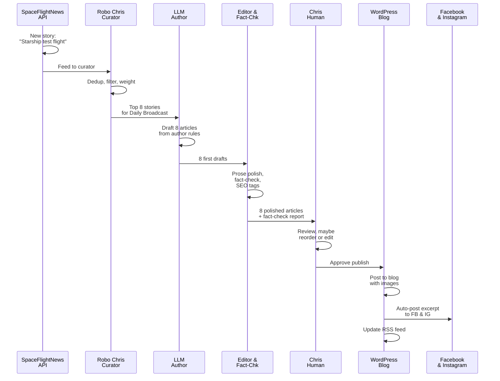

# The editorial pipeline

Every article you read has walked through seven stages—from raw data to published story to social distribution. Let's pull back the curtain.

## Discovery: Finding the signal

The pipeline starts before any AI sees the story. We cast a wide net across multiple sources:

- **SpaceFlightNews API (SNAPI)** — curated, professional aerospace journalism
- **Launch Library 2** — launch schedules, mission data, verified facts
- **Crawl4AI web scraper** — targeted site scrapers for niche news outlets and curated blogs
- **Wikipedia lookups** — historical context and biographical details
- **RSS feeds** — industry blogs, space agencies, commercial operators

These sources feed into Robo Chris (our curator system) continuously. No filtering yet—just collection.

!!! info "Why multiple sources?"
    One source alone misses stories. NASA announcements hit LL2 first. SpaceX milestones break on tech blogs days before traditional media picks them up. Combining them gives us breadth *and* speed.

## Curation: Robo Chris decides what matters

This is where Robo Chris earns its name. The curator system:

1. **Deduplicates** — same story, five different sources? Pick the best version.
2. **Filters** — is this actually news? Or promotional? Our relevance heuristics (powered by vector similarity and topic matching) decide.
3. **Weights** — which stories rise to the top? Canadian angle? Commercial space? Scientific breakthrough? The weighting rules adjust per workflow.
4. **Gates by schedule** — daily stories always go; weekly spotlights check if it's Monday or Friday; monthly deep dives check if it's the right week of the month.

The curator produces a ranked candidate list. Nothing gets dropped—we just order them by fit.

!!! tip "The human curator still matters"
    Robo Chris doesn't *publish* anything. It recommends. If something smells wrong (or if a big story gets missed), Chris (human) can manually override the ranking or add stories before the drafting stage.

## Drafting: The LLM author

Once curation is done, the top stories go to the LLM author. We use:

- **Primary:** Google Gemini 2.5 Flash — fast, good at casual prose, strong on tone
- **Fallback:** Anthropic Claude Haiku 4.5 — excellent writing quality, good on nuance
- **Secondary fallback:** xAI Grok 3 — backup redundancy

The author doesn't freestyle. It works from **author rules**—a structured prompt that includes:

- Tone and voice (second person, slightly nerdy, transparent)
- Article structure (opener, body, CTA, byline)
- Length targets (daily ~1200 words, monthly deep dives ~2000+)
- House style (hyperlinks, source attribution, no AI hype)
- SEO guidance (keyword placement, meta description)

The output is a first draft with title, body, featured image candidate, and social excerpt.

!!! example "Sample author-rule output"
    ```
    Title: "How Axiom's Starlab Could Change Commercial Space Stations"
    
    Body starts: "You've probably heard the hype around commercial space stations. 
    But here's the actual story behind Axiom Space's Starlab project..."
    
    Includes:
    - Hyperlinks back to source articles
    - Background context (what's Axiom?)
    - Why this matters (economics, accessibility, timeline)
    - Relevant launches/milestones
    ```

## Editing: LLM polish + SEO

A second LLM pass (Claude Haiku primary, Grok fallback) refines the draft:

- **Prose editing** — flow, clarity, fact-checking for obvious errors
- **SEO fields** — generating meta description, suggested tags, keyword density
- **House style enforcement** — consistent formatting, capitalization, hyphenation
- **Source links** — verifying that every factual claim links back to a source

This pass doesn't rewrite from scratch; it polishes what the author drafted.

## Fact-checking: Automated verification

Before anything publishes, an LLM fact-checker runs:

1. **Identifies claims** — pulls out factual assertions (dates, numbers, agency names, etc.)
2. **Cross-references sources** — checks claims against the original articles we cited
3. **Flags discrepancies** — if something doesn't match, it raises a flag for human review
4. **Signs off** — if everything checks, it marks the article ready for human review

This is *not* a catch-all. The fact-checker works from the sources we already have. But it prevents copy-paste errors and catches numbers that got corrupted in translation.

!!! success "Fact-checking in the pipeline"
    Every article gets a fact-check pass. If the checker flags something, Chris reviews the sources manually. No article publishes with open fact-check flags.

## Publishing: WordPress API

Articles approved by Chris go to the blog via the WordPress REST API:

- Title, body, featured image
- SEO metadata (generated earlier)
- Author (with "Drafted by [Model]" byline)
- Categories and tags
- Publish timestamp (usually immediate, sometimes scheduled)

Images pull from our **tcs-images** GitHub repository—a folder structure organized by date and topic.

## Distribution: Social + RSS

The moment an article publishes to WordPress:

1. **Facebook & Instagram** — automated posts fire with the excerpt, link, and featured image
2. **RSS feed** — updated immediately; subscribers see it in their readers
3. **Syndication** — the full article is now live, indexable, discoverable

This happens in parallel. No manual posting needed.

---

## The flow: A real-world example



From SNAPI ingestion to RSS subscribers seeing the story: **under 60 minutes** for daily broadcasts. Weekly and monthly pieces take longer because they're research-heavy, but the pipeline is the same.

---

*Next: [Meet Robo Chris →](robo-chris.md)*
