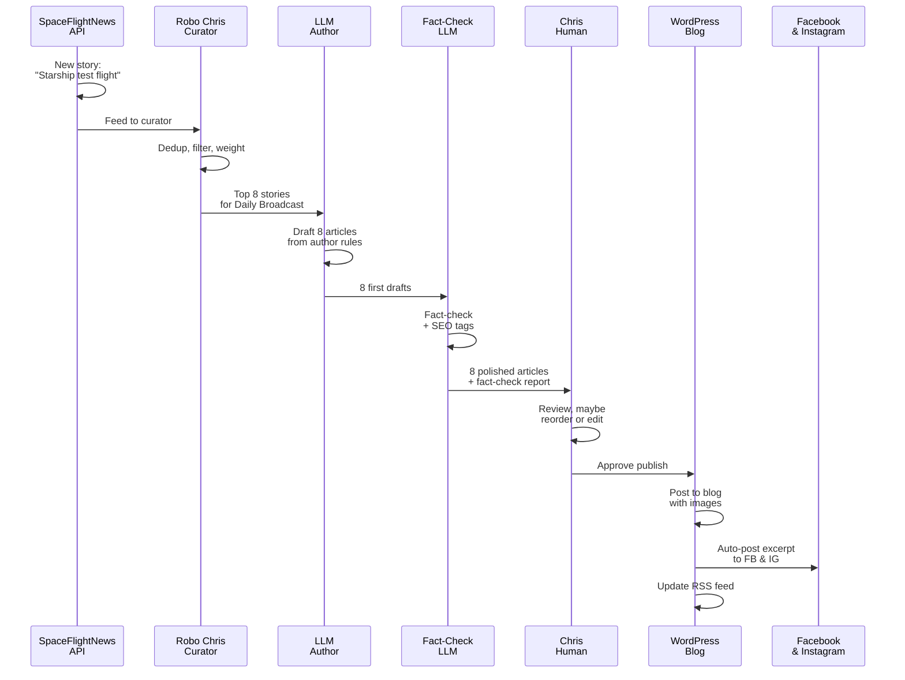

# The editorial pipeline

Every article we publish walks through the same pipeline — from raw data to published story to social distribution. Let's pull back the curtain.

## Discovery: finding the signal

The pipeline starts before any AI sees the story. We cast a wide net across multiple sources:

- **Spaceflight News API (SNAPI)** — aggregated aerospace news
- **Launch Library 2** — launch schedules, mission data, verified facts
- **X/Twitter (self-hosted scraper)** — official accounts from Rocket Lab, Blue Origin, CSA, NASA, and others
- **RSS feeds** — SpaceQ and other aerospace outlets
- **Targeted web scrapers** — for niche outlets and pages that don't expose an API (ScraperAPI, Browserless, ScrapingBee)
- **Wikipedia lookups** — historical context and background details

These sources feed into Robo Chris (our curator system) continuously. No filtering yet — just collection.

!!! info "Why multiple sources?"
    One source alone misses stories. NASA announcements hit LL2 first. SpaceX milestones break on X before traditional outlets pick them up. Combining them gives us breadth *and* speed.

## Curation: Robo Chris decides what matters

This is where Robo Chris earns its name. The curator system:

1. **Deduplicates** — same story across five sources? Pick the best version.
2. **Filters** — is this actual news, or promotional fluff?
3. **Weights** — which stories rise to the top? Canadian angle? Commercial space? Scientific breakthrough? Weights adjust per workflow.
4. **Gates by schedule** — daily stories always go; weekly spotlights check the day of the week; monthly deep dives check the week of the month.

The curator produces a ranked candidate list. Nothing gets dropped — we just order them by fit.

!!! tip "The human still matters at every step"
    Robo Chris doesn't *publish* anything. It recommends. If something smells wrong (or a big story got missed), Chris can manually override the ranking or add stories before drafting begins.

## Drafting: the LLM author

Once curation is done, the top stories go to the LLM author. We use:

- **Primary:** Qwen (via OpenRouter) — clean, structured HTML output, cost-effective
- **Fallback:** DeepSeek (via OpenRouter) — reliable backup with strong writing quality
- **Social captions:** xAI Grok — handles the Facebook/Instagram excerpt writing

The author doesn't freestyle. It works from **author rules** — a structured prompt that includes:

- Tone and voice (second-person, slightly nerdy, transparent)
- Article structure (opener, body, source links, byline)
- Length targets (daily ~1200 words, monthly deep dives ~2000+)
- House style (hyperlinks, source attribution, no AI hype)
- SEO guidance (keyword placement, meta description)

The output is a first draft with title, body, featured image candidate, and social excerpt.

## Editing & fact-checking

Before anything publishes, an LLM fact-checker runs:

1. **Identifies claims** — pulls out factual assertions (dates, numbers, agency names, mission details)
2. **Cross-references sources** — checks claims against the original articles we cited
3. **Flags discrepancies** — if something doesn't match, it raises a flag for human review
4. **Signs off** — if everything checks, it marks the article ready for Chris

This is *not* a catch-all. The fact-checker works from the sources we already have. But it prevents copy-paste errors and catches numbers that got mangled in summarization.

!!! success "Fact-checking in the pipeline"
    Every article gets a fact-check pass. If the checker flags something, Chris reviews the sources manually. No article publishes with open flags.

## Human review: the non-negotiable gate

Every article — daily broadcast, weekly spotlight, monthly deep dive — is read by Chris before it publishes. He reads the draft, opens the sources, cross-checks the facts, and either approves, edits, or sends back for revision.

The AI drafts. The human decides. Nothing goes live without a real person putting their name on it.

## Publishing: WordPress API

Approved articles go to the blog via the WordPress REST API:

- Title, body, featured image
- SEO metadata (generated earlier)
- Author byline (with the drafting model credited)
- Categories and tags
- Publish timestamp

Images pull from our **tcs-images** GitHub repository — a folder structure organized by date and topic.

## Distribution: social + RSS

The moment an article publishes to WordPress:

1. **Facebook & Instagram** — automated posts fire with the excerpt, link, and featured image
2. **RSS feed** — updated immediately; subscribers see it in their readers
3. **Syndication** — the full article is live, indexable, and discoverable

This happens in parallel. No manual posting needed.

---

## The flow: a real-world example

From SNAPI ingestion to RSS subscribers seeing the story: **under 60 minutes** for daily broadcasts. Weekly and monthly pieces take longer because they cover more ground and pull from more sources — but the pipeline is the same.

---

*Next: [Meet Robo Chris →](robo-chris.md)*
