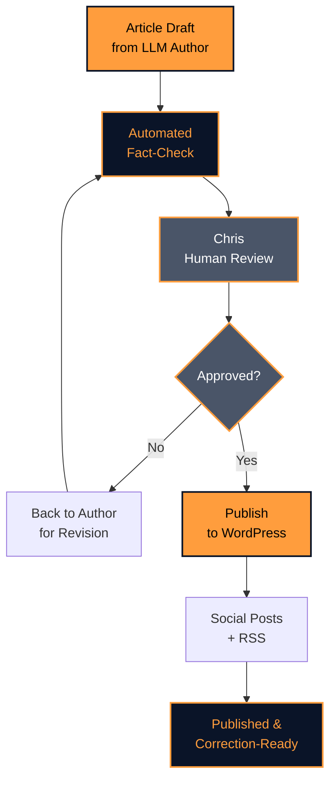

# Quality assurance

We publish AI-drafted articles. We also publish them with full transparency about the AI involved and the quality gates they pass through. Here's how we keep things trustworthy.

## Human in the loop

Every single article—whether it's a 1,200-word daily broadcast or a 3,000-word monthly deep dive—is reviewed by a human before it publishes. Chris reads the final draft, checks the facts, reads the sources, and makes the call. If something feels off, it doesn't go live. If something needs tweaking, we tweak it. The AI drafts; the human decides.

This isn't a token gesture. It's the foundation of our editorial process.

## Automated fact-checking

Before Chris even sees an article, an LLM fact-checker runs a verification pass:

1. **Identifies factual claims** — dates, numbers, names, mission details
2. **Cross-references sources** — checks each claim against the original articles we cited
3. **Flags discrepancies** — if a number doesn't match, or a launch date got corrupted, it raises a flag
4. **Generates a report** — Chris can see which claims checked out and which ones need manual review

This catch doesn't prevent all errors. But it dramatically reduces copy-paste mistakes and accidental factual drift between source and published article.

!!! success "Fact-checking by default"
    Every article gets a fact-check pass. Flagged claims go to manual review. Nothing with open flags publishes.

## Source attribution

You'll always find a link back to the original story. Every factual claim should be traceable to its source. We don't paraphrase a claim and then bury the source three paragraphs later. The hyperlink lives right there where we use the information.

This serves two purposes:

1. **Verification** — you can click through and read the source yourself
2. **Credit** — we're not stealing journalism from other outlets. We're curating, contextualizing, and linking

## Corrections policy

Mistakes happen. When they do, we:

1. **Acknowledge** — we publish a note or correction in the post itself (usually at the top)
2. **Fix** — we update the article to reflect the correct information
3. **Explain** — we say what was wrong and why (human error, source error, LLM misreading, etc.)
4. **Log** — we keep a running log of corrections for transparency

You should never have to second-guess whether something you read here is still accurate. Corrections are visible.

## Model transparency

At the bottom of every article, you'll see a byline that tells you which LLM drafted it:

> *Drafted by Gemini 2.5 Flash. Edited by Claude Haiku 4.5. Fact-checked by Claude Haiku. Reviewed by Chris.*

We don't hide the AI. We name it. This matters because:

- **Different models have different strengths.** Gemini is great at conversational tone; Claude excels at nuance. Knowing which one drafted your article helps you calibrate.
- **Transparency builds trust.** We're not pretending this is 100% human-written. We're saying, "Here's what we built. Here's who/what touched it. Judge for yourself."
- **It's honest.** This is the cutting edge of publishing. Transparency about the method is part of the integrity.

---

## The QA stack

---

!!! success "Our QA commitment"
    Every article is fact-checked, every article is human-reviewed, every claim is sourced, and every error is corrected visibly. We're not perfect. But we're transparent about how we try.

*Next: [Publishing Workflows →](../workflows/index.md)*
