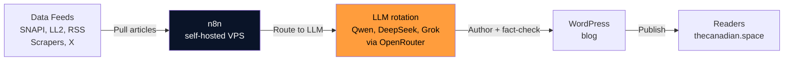

# Technology

You're looking at a fully transparent, self-hosted operation. No black boxes. Below is a no-BS look at the tools that make *The Canadian Space* run — from the VPS to the AI models drafting the daily aerospace briefing to the data sources feeding it all.

We believe in learning in public. So here's how we do it.

- :material-server: **[Tech Stack](tech-stack.md)**

    ---

    The specific tools, models, and platforms we use — n8n, Docker, Qwen/DeepSeek/Grok, WordPress, and every data source that feeds the pipeline.

- :material-network: **[Infrastructure](infrastructure.md)**

    ---

    A deep dive into our self-hosted setup: why we chose it, how it's laid out, and why cost and control matter.

## High-level architecture

The heart of it all is **n8n**, our workflow orchestration engine, running self-hosted on a Digital Ocean droplet. It pulls from multiple sources, routes drafts through a pool of LLMs via OpenRouter, and lands finished stories on WordPress.

Every process is auditable. Every dependency is documented. That's the TCS way.

---

Ready to dig deeper? Start with [Tech Stack](tech-stack.md) or [Infrastructure](infrastructure.md).
