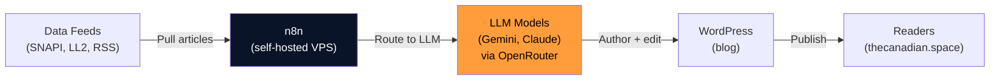

# Technology

You're looking at a fully transparent, self-hosted operation. No black boxes. Below is a no-BS look at the tools that make *The Canadian Space* run—from the infrastructure on our VPS to the AI models drafting your daily aerospace briefing to the data sources feeding it all.

We believe in learning in public. So here's how we do it.

- :material-server: **[Tech Stack](tech-stack.md)**
  
  The specific tools, models, and platforms we use: n8n, Docker, Gemini, Claude, WordPress, and more.

- :material-network: **[Infrastructure](infrastructure.md)**
  
  A deep dive into our self-hosted OVH setup: why we chose it, how it's laid out, and why cost and control matter.

- :material-database: **[Data Sources](data-sources.md)**
  
  Where the news comes from: APIs, scrapers, Wikipedia, RSS feeds—and how we handle it ethically.

## High-level architecture

The heart of it all is **n8n**, our workflow orchestration engine, running on a self-hosted VPS. It pulls from multiple sources, routes content through a pool of LLM models (Google Gemini 2.5 Flash as primary, Claude Haiku 4.5 as fallback and editor), and lands everything on WordPress.

Every token spent is tracked. Every process is auditable. That's the TCS way.

---

Ready to dig deeper? Start with [Tech Stack](tech-stack.md) or [Infrastructure](infrastructure.md).
