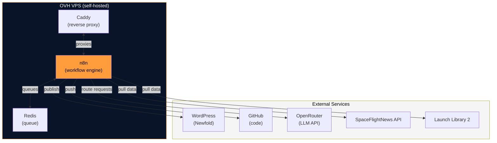

# Infrastructure

The Canadian Space runs on a self-hosted setup. We own the hardware contract, manage the deployments, and see exactly what's happening at every layer. Here's why that matters, and how it's built.

## The layout

At the core is a **single OVH VPS** running Docker Compose. Inside: n8n (workflow orchestration), Redis (job queue), and Caddy (reverse proxy). Outside: WordPress on Newfold, GitHub for code, OpenRouter for LLM routing, and a handful of APIs feeding data in.

## Why self-hosted?

We made a deliberate choice to self-host instead of using a fully managed platform (Zapier, Make, Patreon, etc.). Here's why:

**Control**
You see exactly what we're running, and we control our own destiny. No surprise pricing tiers, no "your feature request is on the roadmap," no waiting for third-party approval to add a new data source.

**Learning**
Running our own infrastructure keeps us sharp. We understand caching, queueing, error handling, and production operations—not just the happy path.

**Openness**
Open-source at the core (n8n, Docker, Caddy) means you can audit what we're doing, contribute improvements, and fork if you want to build your own version.

## Disaster recovery & redundancy

Our n8n workflows are version-controlled on GitHub. WordPress backups are automated. If the VPS goes down, we can spin up a new one and restore from our images in under an hour.

For critical workflows (Daily Broadcast, editorial routing), we've built fallback routes: if Gemini is unavailable, Claude steps in. If one data source is down, others keep pulling.

---

!!! tip "Want to learn more?"
    Check out [Data Sources](data-sources.md) to see where the news comes from, or dive into [Tech Stack](tech-stack.md) for a component-by-component breakdown.
