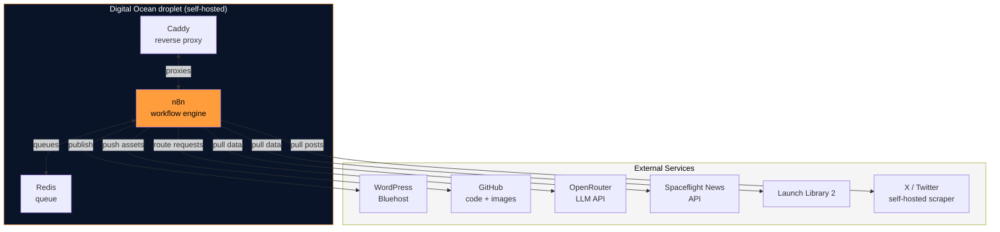

# Infrastructure

The Canadian Space runs on a self-hosted setup. We own the hardware contract, manage the deployments, and see exactly what's happening at every layer. Here's why that matters, and how it's built.

## The layout

At the core is a **single Digital Ocean droplet** running Docker Compose. Inside: n8n (workflow orchestration), Redis (job queue), and Caddy (reverse proxy). Outside: WordPress on Bluehost, GitHub for code and image hosting, OpenRouter for LLM routing, and a handful of aerospace APIs feeding data in.

## Why self-hosted?

We made a deliberate choice to self-host instead of using a fully managed platform (Zapier, Make, etc.). Here's why:

**Control.** We see exactly what we're running and control our own destiny. No surprise pricing tiers, no "your feature request is on the roadmap," no waiting for a third party to approve a new data source.

**Learning.** Running our own infrastructure keeps us sharp. We understand caching, queueing, error handling, and production operations — not just the happy path.

**Openness.** Open-source at the core (n8n, Docker, Caddy) means anyone can audit what we're doing, contribute improvements, or fork and build their own version.

## Disaster recovery & redundancy

Our n8n workflows are version-controlled on GitHub. WordPress backups are automated. If the droplet goes down, we can spin up a new one and restore from our images in under an hour.

For critical workflows (Daily Broadcast, editorial routing), we've built fallback routes: if Qwen is unavailable, DeepSeek steps in. If one data source is down, the others keep pulling. The pipeline degrades gracefully rather than failing outright.

---

!!! tip "Want more?"
    See the full component-by-component breakdown on [Tech Stack](tech-stack.md).
