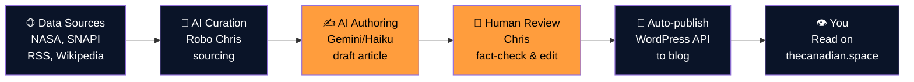

# What is The Canadian Space?

The Canadian Space is an automated aerospace news platform that delivers aerospace stories from a distinctly Canadian editorial lens. Built by one person, published 24/7 by machines and humans working together, TCS brings clarity to the chaos of space news—no hype, no clickbait, just stories that matter to Canada and the world beyond our atmosphere.

Every day, we pull from dozens of aerospace data sources (NASA feeds, SpaceFlightNews API, Launch Library 2, Rocket Lab updates, Blue Origin announcements, and more). An AI author drafts the narrative. A human journalist fact-checks and publishes. A second AI pass reviews for accuracy. And then the story goes live on [thecanadian.space](https://thecanadian.space){ target="_blank" rel="noopener" }—automatically, on schedule, ready for you.

Why does this matter? Aerospace news usually lives in silos: industry press for professionals, NASA.gov for spaceflight nerds, Reddit threads for enthusiasts. TCS glues them together with a Canadian voice, transparent about how we do it, and built to scale.

- :fontawesome-solid-bullseye:{ .lg .middle } **Our Mission**
  
  Why we exist and who we're here for.
  
  [Read more →](mission.md)

- :fontawesome-solid-list-check:{ .lg .middle } **What We Publish**
  
  Daily broadcasts, weekly spotlights, monthly deep dives—the full cadence.
  
  [Read more →](content-categories.md)

- :fontawesome-solid-head-side-virus:{ .lg .middle } **Editorial Philosophy**
  
  How we think about AI in the newsroom, and what we won't compromise on.
  
  [Read more →](editorial-philosophy.md)

---

## How it works in 30 seconds

Every story starts with raw data—then becomes a narrative. Every narrative gets a second set of eyes (and an AI fact-checker) before it reaches you. That's the TCS difference.

---

[Next: Our Mission →](mission.md){ .md-button .md-button--primary }
