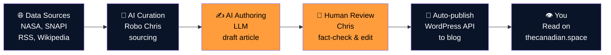

# What is The Canadian Space?

Every day, we pull from dozens of aerospace data sources (NASA feeds, CSA articles, the Spaceflight News API, Launch Library 2, Rocket Lab updates, Blue Origin announcements, X/Twitter, and more). An AI author drafts a narrative summary. A human — Chris — reviews and edits. A second AI pass double-checks for accuracy. Then the story goes live on [thecanadian.space](https://thecanadian.space){ target="_blank" rel="noopener" }, automatically, on schedule.

Our mission is to deliver up-to-date and exciting happenings across the sector, with a particular focus on the budding Canadian commercial launch program.

Why does this matter? Keeping track of everything happening in the aerospace sector is a challenge, so we do the legwork for you. We aggregate, filter, and summarize stories from across the industry with a Canadian voice. We're transparent about how we do it, and built to scale.

- :fontawesome-solid-bullseye:{ .lg .middle } **Our Mission**

    ---

    Why we exist and who we're here for.

    [Read more →](mission.md)

- :fontawesome-solid-list-check:{ .lg .middle } **What We Publish**

    ---

    Daily broadcasts, weekly spotlights, monthly deep dives — the full cadence.

    [Read more →](content-categories.md)

- :fontawesome-solid-scale-balanced:{ .lg .middle } **Editorial Philosophy**

    ---

    How we think about AI in the newsroom, and what we won't compromise on.

    [Read more →](editorial-philosophy.md)

---

## How it works in 30 seconds

Every story starts with raw data — then becomes a narrative. Every narrative gets a second set of eyes (and an AI fact-checker) before it reaches you. That's the TCS difference.

---

[Next: Our Mission →](mission.md){ .md-button .md-button--primary }
