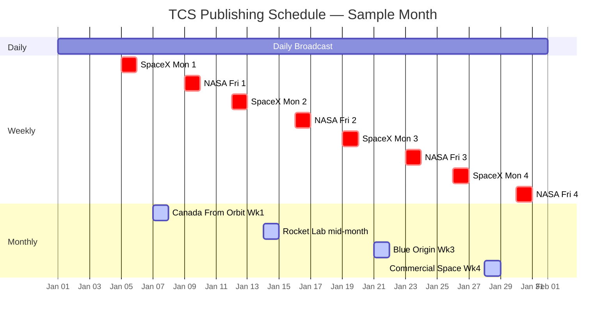

# Publishing workflows

The Canadian Space runs on a schedule. Seven workflows, triggered weekly, each one tailored to a specific audience and cadence. Here's how we slice up the aerospace news cycle.

## The cadence

All workflows trigger on **Wednesday**—that's when Robo Chris curates the week's top stories. Some publish immediately (daily broadcast); others gate on the week of the month (monthly deep dives). Some run on additional days (weekly spotlights fire on Monday and Friday).

Think of Wednesday as the editorial board meeting. Everything that week gets culled and ranked. Then we're ready to publish across the week.

- :material-newspaper:{ .lg .middle } **[Daily Broadcast](daily-broadcast.md)**

    Every morning: your aerospace news roundup. 5–10 curated stories from feeds and APIs, with Chris's editorial touch.

- :material-calendar-week:{ .lg .middle } **[Weekly Spotlights](weekly-spotlights.md)**

    Mondays (SpaceX Report) and Fridays (NASA Overview). Deep dives into the week's biggest story for each.

- :material-calendar-month:{ .lg .middle } **[Monthly Deep Dives](monthly-deep-dives.md)**

    Four specialized monthly workflows that rotate by week: Canada From Orbit, Rocket Lab Roundup, Blue Origin, and Commercial Space.

## The publishing calendar

All workflows are triggered on Wednesdays. Here's the typical week:

## Workflow triggers and gates

| Workflow | Cadence | Day | Gate | Sources |
|----------|---------|-----|------|---------|
| Daily Broadcast | Daily | Every day | None | SNAPI, LL2, RSS, Crawl4AI |
| SpaceX Report | Weekly | Monday | None | SNAPI, LL2, SpaceX feeds |
| NASA Overview | Weekly | Friday | None | NASA RSS, SNAPI, LL2 |
| Canada From Orbit | Monthly | Wed, Week 1 | Week of month | Canadian agencies, SNAPI |
| Rocket Lab Roundup | Monthly | Wed, mid-month | Week 2–3 | Rocket Lab feeds, LL2, SNAPI |
| Blue Origin | Monthly | Wed, Week 3 | Week of month | Blue Origin news, LL2 |
| Commercial Space | Monthly | Wed, Week 4 | Week of month | Industry news, VC, SNAPI |

!!! tip "What's a week gate?"
    Monthly deep dives run *only* if today falls in the correct week of the month. Canada From Orbit won't publish if it's week 3; it waits for week 1. This prevents all four monthly pieces from piling up the same day.

## Data flow: from curation to publication

Every workflow follows the same pipeline:

1. **Curation (Robo Chris)** — sources are ingested; stories ranked by relevance to the workflow type
2. **Drafting (LLM Author)** — top stories drafted using workflow-specific author rules
3. **Editing & Fact-Checking** — prose polished, facts verified, SEO tags generated
4. **Human Review** — Chris approves or revises before publish
5. **Publishing** — article posts to WordPress; social posts fire automatically
6. **Distribution** — RSS feed updated; Facebook & Instagram get the story

All seven workflows share the same pipeline code. The only differences are the author rules (tone, length, topic focus) and the curation weights (which topics matter for this workflow).

---

## How to read these docs

Each workflow page tells you:
- **What it is** — the editorial angle and target reader
- **When it publishes** — cadence and day of week
- **What sources it uses** — which feeds, APIs, or scrapers feed into it
- **What it sounds like** — the tone and style (sample opener)

*Next: [Daily Broadcast →](daily-broadcast.md)*
