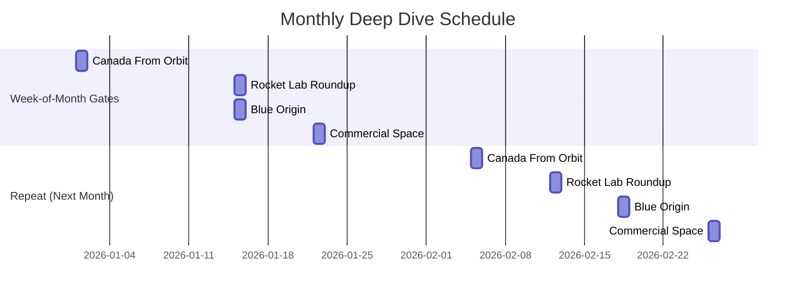

# Monthly deep dives

Four times a month, we publish a **deep dive**—a long-form, research-heavy article that zooms way in on a specific sector or company. These are our most ambitious pieces: 2,000–3,500 words, multiple sources, historical context, and forward-looking analysis.

Each monthly deep dive targets a different vertical, and each one publishes during a specific week of the month. This prevents all four from piling up the same day and ensures consistent rhythm across the month.

## The four deep dives

=== "Canada From Orbit (Week 1)"

    **Canadian space activity, companies, and policy.**
    
    Publishes: **First Wednesday of the month**
    
    ### Coverage area
    
    - Canadian Space Agency (CSA) programs and announcements
    - Canadian companies in space (MDA, Axiom, etc.)
    - Canadian astronauts and international partnerships
    - Canadian Earth observation and climate missions
    - Regulatory and policy developments
    - Economic impact of space spending in Canada
    
    ### Sources
    
    - Canadian Space Agency RSS and news releases
    - SpaceFlightNews API (Canada-tagged stories)
    - Crawl4AI scrapers for Canadian space companies and research institutions
    - Canadian government announcements (innovation, infrastructure, trade)
    - Industry publications (SpaceNews, Via Satellite, etc.)
    
    ### Length & voice
    
    2,000–2,500 words. Proud but analytical. We celebrate Canadian accomplishments without hype. Heavy on economic and industrial context. Aimed at Canadian readers *and* international readers curious about Canadian space policy.
    
    !!! example "Sample angle"
        **"Canada's ISS presence just expanded with a new Canadarm3 contract extension. But here's the bigger story: how CSA's robotics program became a crucial leverage point in international negotiations—and why that matters as space politics get tenser."**

=== "Rocket Lab Roundup (Mid-Month)"

    **Rocket Lab's missions, roadmap, and place in the commercial launch market.**
    
    Publishes: **Mid-month Wednesday** (typically week 2–3, gates on specific dates)
    
    ### Coverage area
    
    - Electron rocket launches and manifest
    - Neutron development and testing
    - Customer acquisition and partnerships
    - Orbital debris and constellation services
    - New Zealand and international operations
    - Market position vs. competitors
    
    ### Sources
    
    - SpaceFlightNews API (Rocket Lab-tagged)
    - Launch Library 2 (Rocket Lab manifest)
    - Rocket Lab official updates and investor calls
    - Crawl4AI for industry analysis and competitive positioning
    - Customer announcements (satellite operators, government agencies)
    
    ### Length & voice
    
    2,000–2,500 words. Technical and business-focused. Rocket Lab is small and scrappy compared to SpaceX, so the narrative emphasizes efficiency, niche market strategy, and how a smaller player carves out space in a crowded industry.
    
    !!! example "Sample angle"
        **"Rocket Lab's Neutron development just hit a milestone, but the economics are the real story. Here's the math on how small/medium launch vehicles stay profitable when SpaceX's Falcon 9 costs keep dropping."**

=== "Blue Origin (Week 3)"

    **Blue Origin's space vehicles, infrastructure, and commercial plans.**
    
    Publishes: **Third Wednesday of the month**
    
    ### Coverage area
    
    - New Glenn and New Shepard development
    - Blue Moon lunar lander program
    - ULA partnership and launch services
    - Suborbital tourism and point-to-point flights
    - Infrastructure investments (launch pads, manufacturing)
    - Bezos's influence and funding
    
    ### Sources
    
    - SpaceFlightNews API (Blue Origin-tagged)
    - Launch Library 2 (New Shepard and future launches)
    - Blue Origin press releases and investor updates
    - ULA announcements and shared projects
    - Industry analysis on Blue Origin's market strategy
    
    ### Length & voice
    
    2,000–2,500 words. Analytical and critical. Blue Origin operates at scale (unlike Rocket Lab) but is less transparent than SpaceX, so our coverage emphasizes *what we know*, *what we're guessing*, and *what we're waiting to see*. Heavy on timeline skepticism and technical risk assessment.
    
    !!! example "Sample angle"
        **"Blue Origin just pushed New Glenn's maiden flight to 2026. For the third time. Here's why the delays make sense—and why this heavy-lift vehicle might still be the dark horse in the commercial market."**

=== "Commercial Space (Week 4)"

    **Industry-wide trends, startups, and commercial space economics.**
    
    Publishes: **Fourth Wednesday of the month**
    
    ### Coverage area
    
    - Space debris removal (Astroscale, Clearspace, etc.)
    - Space tourism and suborbital flights
    - In-orbit refueling and on-orbit services
    - Commercial space stations (Axiom, Orbital Reef, etc.)
    - Satellite constellation economics (Kuiper, OneWeb, etc.)
    - Space venture capital and funding trends
    - Export control and regulatory news
    - International commercial competition
    
    ### Sources
    
    - SpaceFlightNews API (broad coverage)
    - SpaceNews and Via Satellite (trade publications)
    - Crawl4AI for startup blogs and investor announcements
    - LinkedIn and company press releases
    - Patent filings and regulatory submissions
    
    ### Length & voice
    
    2,500–3,500 words. Highest ceiling of all deep dives. Commercial Space is the broadest category, so we use the extra room to explore a theme or trend in depth. Might focus on one month's mega-trends (e.g., "the race to deorbit") or zoom into a specific startup ecosystem.
    
    !!! example "Sample angle"
        **"Five companies just announced in-orbit refueling test missions. None of them have flown yet. Here's why the technology is suddenly plausible—and which company has the best shot at going first."**

---

## The publishing schedule

!!! info "Week-of-month gates explained"
    Each deep dive workflow checks: "Is today in the right week of the month?" 
    
    - Canada From Orbit fires only on Week 1 Wednesdays
    - Rocket Lab fires on a mid-month Wednesday (typically Week 2–3, but gates prevent Week 1 and 4)
    - Blue Origin fires only on Week 3 Wednesdays
    - Commercial Space fires only on Week 4 Wednesdays
    
    This ensures we publish one deep dive per week, never two on the same day.

---

## How deep dives are researched

All monthly deep dives follow the same editorial pipeline, but with a longer timeline:

1. **Curation (Week before publication)** — Robo Chris ranks stories relevant to this month's vertical
2. **Research & Drafting (2–3 days before)** — the LLM author gets more source material and a longer prompt to synthesize
3. **Editing & Fact-Checking (1 day before)** — extra scrutiny for longer articles and more complex claims
4. **Human Review (morning of)** — Chris reviews, fact-checks complex statements, and approves
5. **Publishing (afternoon)** — scheduled for consistent time
6. **Distribution** — social posts and RSS

The research phase is longer because deep dives require more context and more sources. We don't just string together daily news; we analyze trends and connect dots.

---

*All set! You now understand the full TCS publishing ecosystem. Questions? Check out [How It Works →](../how-it-works/index.md) for the editorial pipeline and quality standards.*
